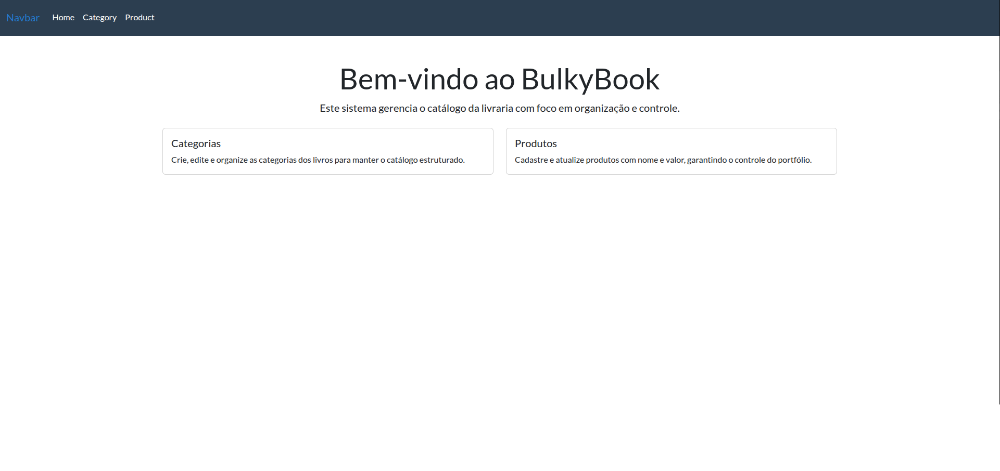
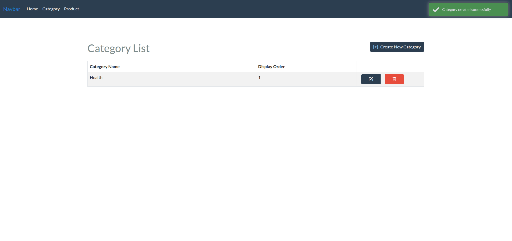
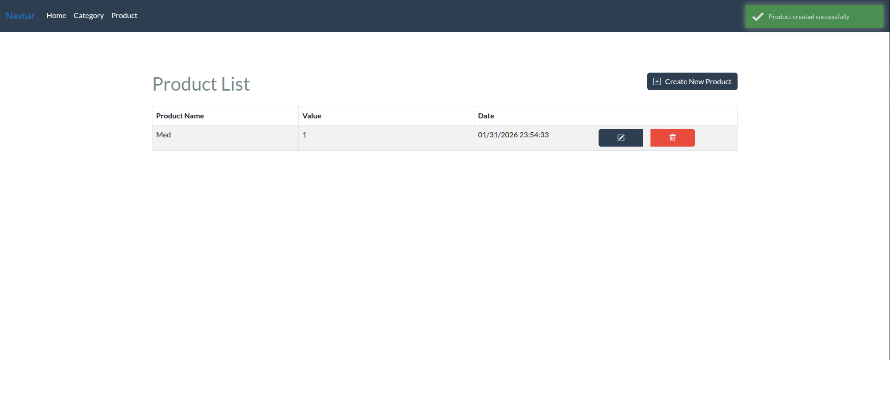

# BulkyBook

## Sobre o projeto (PT-BR)

BulkyBook e uma aplicacao ASP.NET Core (.NET 10) para gerenciar o catalogo de uma livraria. O sistema permite cadastrar e organizar categorias e produtos, com operacoes de criacao, edicao e exclusao.

## About the project (EN)

BulkyBook is an ASP.NET Core (.NET 10) application to manage a bookstore catalog. It lets you create, edit, and delete categories and products.

## Screenshots





## Como rodar com Docker Compose (PT-BR)

1. Suba os containers:

```bash
docker compose up -d --build
```

2. Acesse a aplicacao em `http://localhost:8080`.
3. Para parar:

```bash
docker compose down
```

Observacoes:

- A senha do SQL Server esta em `docker-compose.yml` (variavel `MSSQL_SA_PASSWORD`). Troque antes de usar em ambiente real.
- As migrations sao aplicadas automaticamente na inicializacao (env `ApplyMigrations=true`).
- Para limpar o banco, use `docker compose down -v`.

## Run with Docker Compose (EN)

1. Start the containers:

```bash
docker compose up -d --build
```

2. Open the app at `http://localhost:8080`.
3. Stop everything:

```bash
docker compose down
```

Notes:

- The SQL Server password is set in `docker-compose.yml` (`MSSQL_SA_PASSWORD`). Change it before any real use.
- Migrations run automatically on startup (`ApplyMigrations=true`).
- To remove the database volume, run `docker compose down -v`.
